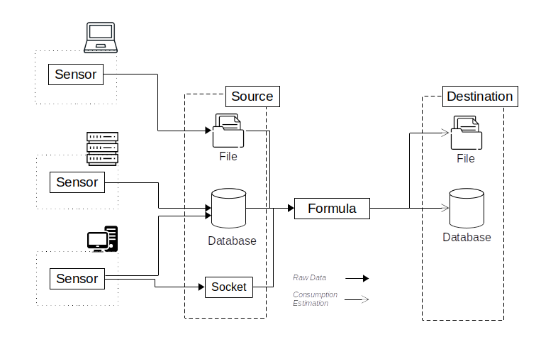

---
hide:
  - navigation
  #- toc
#template: intro.html
---
# PowerAPI
The goal of this project is to provide a set of tools to go forward a greener
computing.
The idea is to provide software-defined PowerMeters to mesure the power
consumption of programs.
The core of this project is the [PowerAPI](https://github.com/powerapi-ng/powerapi) toolkit for building
such PowerMeters.

[Geting started](getting_started){ .md-button .md-button--primary}
[:fontawesome-brands-github: GitHub](https://github.com/powerapi-ng/){ .md-button}

## Software PowerMeters

A software PowerMeter is an application built with the PowerAPI components that can
measure the power consumption of software running on a single machine or on a
cluster of machine.

The Figure below depicts the global architecture of a software PowerMeter in PowerAPI.
{ width="1000px" }

<!--img
src="assets/images/intro/global-architecture.png"
alt="PowerMeter Architecture" width="1000px"-->

A PowerMeter has two components, a Sensor and a Formula, used to
produce an estimation of the power consumption of a monitored software.

## Sensor

The Sensor is an independent software that collects raw data (metrics) correlated with the power consumption of the
monitored software.

Data are collected by querying the hardware’s machine that hosts the monitored
software. The sensor must be executed on the same machine as the monitored
software. The data are collected throughout the duration of the software. For
this reason, the sensor must operate in parallel.

Collected raw data are stored in an external Source to make the data available to
the Formula. This Source may be hosted on an other machine.

### Usage

Because they collect from different hardware, each Sensor is very different
from one another. Currently, PowerAPI proposes two Sensors: [HWPC](sensors/hwpc-sensor.md) and [Procfs](sensors/procfs-sensor.md).
Refer to each Sensor documentation to know how to use them.

## Formula

A Formula is a computational module that computes an estimation of the power
consumption of monitored software from the data collected by the sensor.

A Formula has two working modes:

- `stream` mode where the Formula read the data from the Sensor as they are
  produced (in realtime).

- `post-mortem` mode where the Formula analyses the data already collected by the Sensor in a past monitoring phase.

### Usage

Currently, there are two Formulas: [RAPL](formulas/rapl.md) and [SmartWatts](formulas/smartwatts.md).
Refer to each Formula documentation to know how to use them.

## Consortium

<table style="border:0px;margin-left:auto; margin-right:auto;">
    <tbody>
        <tr>
            <td align="center" style="border:0px;">
              

            </td>
            <td align="center" style="border:0px;">
              

            </td>
            <td align="center" style="border:0px;">
              

            </td>
        </tr>
        <tr >

            <td align="center" style="border:0px;" colspan="3">
              

            </td>
        </tr>
    </tbody>
</table>

## Mailing list

You can follow the latest news and asks questions by subscribing to our <a href="mailto:sympa@inria.fr?subject=subscribe powerapi">mailing list</a>.
