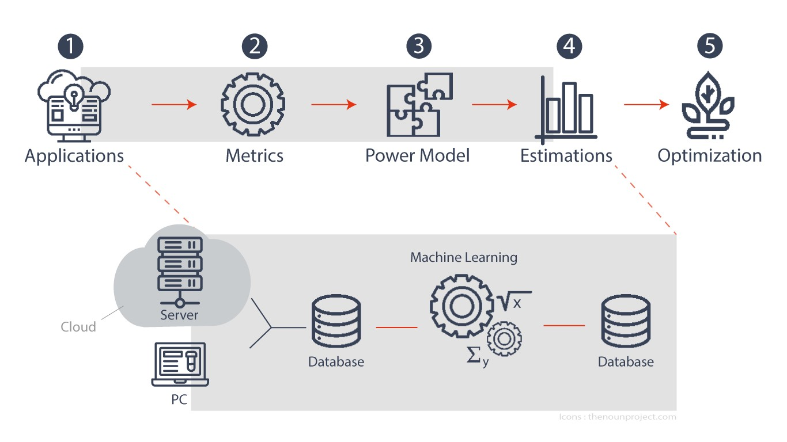

---
hide:
  - navigation
  - toc
#template: intro.html
---

  

# PowerAPI

Measuring Power Consumption of your Applications.

[Geting started](getting_started){ .md-button .md-button--primary}
[:fontawesome-brands-github: GitHub](https://github.com/powerapi-ng/){ .md-button}  

  

{ width="800px" align=right .tx-hero__image}

---

<!-- div class="grid cards" markdown-->

  

:material-lightning-bolt-circle:{ .lg .middle } __Powermeter as Software__
---
 You don't need any additional physical Powermeter or hardware in order to estimate power consumption of your applications.
 PowerAPI toolkit allows you to use Software Powermeters providing power consumption at different granularity levels: *global*, *virtual machine*, *container* *application*, *processus*, *code*.
  

  

:fontawesome-solid-arrow-up-right-from-square:{ .lg .middle } __Extensible__
---
The actor based architecture of PowerAPI toolkit enables you to create customized Powermeters by adding new mechanisms for storing metrics and estimations as well as for computing the latter ones.
  

  

:material-open-source-initiative:{ .lg .middle } __Open Source__
---
PowerAPI toolkit is Open Source with a BSD 3-Clause License.
Therefore, you can easily contribute to improve the toolkit.
  

---

# Sponsors

{ width="309px" }
{ width="338px" }
{ width="225px" }
{ width="429px" }

<!-- table style="border:0px;margin-left:auto; margin-right:auto;">
    <tbody>
        <tr>
            <td align="center" style="border:0px;">
              

            </td>
            <td align="center" style="border:0px;">
              

            </td>
            <td align="center" style="border:0px;">
              

            </td>
        </tr>
        <tr >

            <td align="center" style="border:0px;" colspan="3">
              

            </td>
        </tr>
    </tbody>
</table-->

## Mailing list

You can follow the latest news and asks questions by subscribing to our <a href="mailto:sympa@inria.fr?subject=subscribe powerapi">mailing list</a>.
